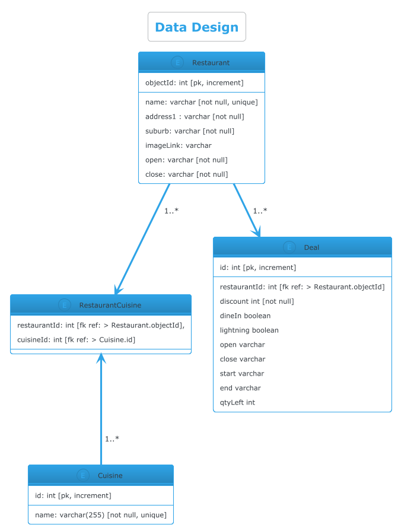

# EatClub

### Assumptions

- input time is in 24 hour format
- Deals have a start and end time or an open and close time
- Data returned from the end point is not changing at a frequent rate so storing data as a class variable as an arbitrary form of caching should be acceptable
- deals with no start and end time or no open and close time are not considered active and are ruled out

### Notes
- calling the endpoint data in the tests is not ideal, should probably provide a mock for this


### Testing 

The API has been deployed to AWS and can be tested using either  the [.http](.http) file and execute the requests from your IDE or using the command line with `curl`.

Get Deals by Time of Day
```bash
curl 'https://fvt3a61408.execute-api.ap-southeast-2.amazonaws.com/dev/eatclub/deals?timeOfDay=18%3A00'
```

Get peak time period
```bash
curl https://fvt3a61408.execute-api.ap-southeast-2.amazonaws.com/dev/eatclub/deals/peaktime
```

## Database Design

**Database choice** : AWS Aurora Serverless 

Given the data model provided it appears reasonable to make use of a relational database as the store and house a normalised data structure.
AWS Aurora is reliable and fault-tolerant with dynamic scaling that offers high availability and durability.

Assuming that data will be queried in various ways, potentially to search for deals by suburb, or the time frame of the deal, or potentially by cuisines offered by the restaurant, a relational database would be a good fit. It allows for complex queries and joins which can be beneficial for the types of queries that may be required.

Without fully understanding how the data will be queried, performance and cost expectations, it is difficult to make a more informed decision on the database choice, however AWS Aurora Serverless remains a good choice for its serverless architecture that can scale.



### Considerations

The cuisines offered by the restaurants have been normalised into a separate table however it could be possible to store cuisines as a json field in the restaurant table. This would allow for more flexibility in the data model and could reduce the number of joins required when querying for restaurants by cuisine. However, it would also make it more difficult to query for restaurants by cuisine and could lead to data inconsistencies if not managed properly.